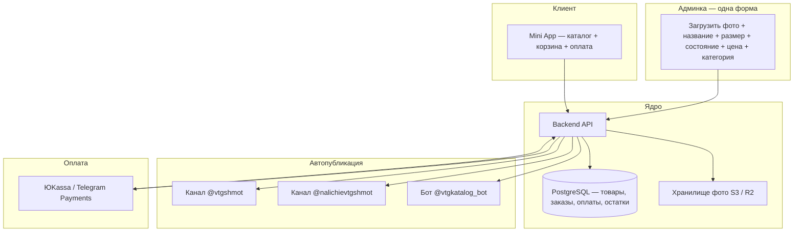

# VTGSHMOT — изучение экосистемы и план автоматизации

> Дата: 28 августа 2026  
> Цель: понять текущий процесс, найти дублирование работы и спроектировать единую систему (каталог → каналы → корзина → оплата → финансы).

---

## 1. Карта экосистемы

| Компонент | Ссылка | Подписчики | Роль |
|-----------|--------|------------|------|
| Основной канал | [@vtgshmot](https://t.me/vtgshmot) | ~22 500 | Витрина, дропы, анонсы, контент |
| Канал «Наличие» | [@nalichievtgshmot](https://t.me/nalichievtgshmot) | ~6 600 | Актуальный список того, что ещё в продаже |
| Mini App / каталог | [@vtgkatalog_bot/shop](https://t.me/vtgkatalog_bot/shop) | — | Каталог, корзина, фильтры |
| Заказы (ручной) | [@vtgceo](https://t.me/vtgceo) | — | Скриншот корзины → менеджер |
| Отзывы | [@otzyvyvtgshmot](https://t.me/otzyvyvtgshmot) | — | Социальное доказательство |
| Офлайн | СПб, ул. Некрасова 52 | — | Шоурум, ивенты, самовывоз |

**Важно:** дублирование может быть не только «канал + приложение», но и **третий канал наличия** — формат постов там почти такой же.

---

## 2. Как выглядит процесс сейчас (реконструкция)

### 2.1 Добавление товара

```
Фото + описание
    ├─► Пост в @vtgshmot (медиагруппа + текст + ссылки)
    ├─► Карточка в Mini App (фото, название, цена, размер, состояние)
    └─► (вероятно) Пост в @nalichievtgshmot
```

### 2.2 Формат поста в канале

Пример (футболка Oakley):

```
Футболка Oakley 00s

> состояние отличное
> размер L
> цена: 6990

Оформить заказ | Полное наличие
```

- Медиагруппа: 3–8 фото (общий вид, детали, бирка, спина).
- Две ссылки внизу — скорее всего deep-link в Mini App (конкретный товар / каталог).
- Анонсы дропов — отдельный тип контента (без цены, только тизер).

### 2.3 Mini App (что видно с UI)

| Экран | Функции |
|-------|---------|
| Каталог | Сетка 2 колонки, фильтр «Весь магазин», фильтр «Размер», поиск |
| Карточка | Галерея, цена, «Добавить в корзину» |
| Корзина | +/- количество, удаление, итого, CTA «Написать @vtgceo» |

**Оформление заказа сейчас полностью ручное:**
> «Для оформления сделайте скриншот корзины и перейдите в диалог с @vtgceo»

Нет встроенной оплаты, нет автоматической резервации товара.

### 2.4 Бизнес-модель (из публичных данных)

- Винтаж, **уникальные позиции** (часто 1 экземпляр).
- Регулярные дропы (в описании канала — ~19:00, в постах — разное время).
- ~5–6 постов в день на основном канале.
- Бренды: Nike, Adidas, Polo RL, Stone Island, Arcteryx, Oakley, YSL и др.
- Доставка + офлайн-точка в СПб.

---

## 3. Проблемы и риски текущей схемы

| Проблема | Почему болит |
|----------|--------------|
| Двойной/тройной ввод | Время, ошибки в цене/размере между каналом и каталогом |
| Скриншот → DM | Медленно, нет трекинга заказов, легко «продать дважды» |
| Нет единого статуса | sold / reserved / available не синхронизированы |
| Нет финансовой аналитики | Выручка, маржа, остатки — вручную или в Excel |
| Нет анти-дубль при оплате | Два клиента могут положить одну уникальную вещь в корзину |

---

## 4. Целевая архитектура (единый контур)



### 4.1 Модель данных (минимум для винтажа)

```sql
-- Товар = уникальная вещь (не массовый SKU)
products (
  id, title, description,
  brand, category,
  size, condition_text,
  price_rub, cost_rub,          -- для маржи
  status,                       -- available | reserved | sold | archived
  reserved_until,               -- TTL резерва при checkout
  channel_post_id,            -- id поста в @vtgshmot
  availability_post_id,       -- id поста в @nalichievtgshmot
  mini_app_slug,              -- deep link
  created_at, sold_at
)

product_images (id, product_id, url, sort_order)

orders (
  id, telegram_user_id, status,
  total_rub, payment_id, payment_status,
  delivery_type, address, created_at
)

order_items (order_id, product_id, price_rub)

payments (id, order_id, provider, amount, status, raw_payload)

-- опционально: drops для анонсов без товаров
drops (id, title, scheduled_at, channel_post_id, status)
```

### 4.2 Жизненный цикл товара

```
available → (клиент checkout) → reserved (15–30 мин)
    → paid → sold (+ убрать из каталога, обновить каналы)
    → timeout / cancel → available
```

Для винтажа **quantity = 1** почти всегда; поле `quantity` нужно только если появятся массовые позиции.

### 4.3 Автопостинг в Telegram

Один вызов `POST /admin/products` должен:

1. Сохранить товар в БД и загрузить фото.
2. `sendMediaGroup` в @vtgshmot с шаблоном текста.
3. Аналогичный (или сокращённый) пост в @nalichievtgshmot.
4. Сделать товар видимым в Mini App API.
5. Сохранить `message_id` постов для будущего редактирования/удаления при продаже.

При продаже:
- Статус → `sold`
- Mini App скрывает карточку
- Редактировать пост в канале: «ПРОДАНО» или удалить из канала наличия

**Требования Telegram:**
- Бот должен быть админом каналов с правом постинга.
- Для каналов — `channel_id` (например `-100...`).

### 4.4 Оплата (РФ)

| Вариант | Плюсы | Минусы |
|---------|-------|--------|
| Telegram Payments + ЮKassa | Оплата внутри Telegram, меньше шагов | Настройка через BotFather, комиссии |
| ЮKassa виджет / ссылка в Mini App | Гибче, знакомый флоу | Выход из «нативного» UX |
| СБП по ссылке | Просто | Ручная проверка, не автоматизирует sold |

**Рекомендация:** Telegram Payments + ЮKassa для B2C в России; webhook на backend для подтверждения и перевода товара в `sold`.

### 4.5 Админка

Варианты по сложности:

1. **Telegram Admin Mini App** — форма внутри Telegram (удобно с телефона на дропе).
2. **Web-панель** — таблица товаров, заказы, выручка, экспорт.
3. **Бот-команды** — `/add` с пошаговым диалогом (быстрый MVP).

Для дропов с телефона часто хватает Mini App админки + автопост.

---

## 5. Поэтапный план (без календарных сроков)

### Этап 0 — Аудит (нужен доступ друга)

- [ ] Кто сделал текущий Mini App? (TGShop / Appy / Posman / кастом / @Sanykon_19?)
- [ ] Есть ли админка каталога и экспорт товаров?
- [ ] Токен бота @vtgkatalog_bot и права бота в каналах?
- [ ] Сколько реально дублируется: 2 или 3 места?
- [ ] Текущий процесс заказа у @vtgceo (CRM, таблица?)

### Этап 1 — MVP «один ввод → всё опубликовано»

- PostgreSQL + простой backend (Node/FastAPI).
- Форма: фото, название, размер, состояние, цена.
- Автопост в 1–2 канала + API для каталога.
- Mini App читает только из API (новый фронт или адаптация текущего).

**Результат:** друг перестаёт делать двойную работу.

### Этап 2 — Заказы без оплаты

- Корзина → «Оформить заказ» → заказ в БД + уведомление @vtgceo.
- Резервация 30 мин без оплаты.
- Админ: список заказов, «подтвердить / отменить».

**Результат:** вместо скриншотов — структурированные заказы.

### Этап 3 — Оплата

- ЮKassa + Telegram Payments.
- Webhook → `paid` → `sold` → синхронизация каналов.

### Этап 4 — Финансы и аналитика

- `cost_rub` на товар → маржа по заказу.
- Дашборд: выручка, средний чек, conversion, топ брендов.
- Остатки = count where status = available.

### Этап 5 — Дропы и маркетинг

- Планировщик анонсов (отдельный тип поста).
- Авто-напоминание в канал за N часов до дропа.
- (Опционально) интеграция с рилсами / репост-скидками из постов.

---

## 6. Стек (рекомендация)

| Слой | Технология | Почему |
|------|------------|--------|
| Backend | **FastAPI** или **Node + Hono** | Быстро, async, webhook-friendly |
| DB | **PostgreSQL** | Заказы, финансы, надёжность |
| ORM | SQLAlchemy / Prisma | — |
| Mini App | **React + Vite** + `@twa-dev/sdk` | Стандарт для TMA |
| Бот | **grammY** / **aiogram 3** | Постинг, уведомления |
| Фото | S3 / Cloudflare R2 | CDN, не зависеть от Telegram file_id |
| Хостинг | VPS (Timeweb / Selectel / Hetzner) | HTTPS обязателен для TMA |
| Оплата | ЮKassa | РФ, Telegram Payments |

Альтернатива «быстрый старт без кода»: TGShop / BotLaunch — но для **полного контура с финансами и кастомным автопостом в два канала** кастомный backend обычно гибче.

---

## 7. Вопросы к другу (чеклист для созвона)

1. Сколько минут уходит на одну позицию (канал + каталог + наличие)?
2. Кто и как сейчас добавляет товары в приложение?
3. Можно ли выгрузить текущий каталог (Excel / API)?
4. Как часто расхождения цены/размера между каналом и приложением?
5. Нужна ли оплата онлайн или часть клиентов только «написать и перевести на карту»?
6. Доставка: СДЭК, Почта, самовывоз — что автоматизировать?
7. Нужен ли доступ сотрудникам шоурума (несколько админов)?
8. Планируются ли массовые дропы (100 джерси) — отличается от одиночных винтажных позиций?

---

## 8. Оценка сложности

| Компонент | Объём | Зависимости |
|-----------|-------|-------------|
| Схема БД + API товаров | Средний | Аудит текущих полей |
| Автопост в 2 канала | Средний | Права бота, шаблоны текста |
| Новый Mini App (каталог) | Средний | Дизайн можно копировать текущий |
| Корзина + резервация | Средний | Уникальные SKU |
| Оплата ЮKassa | Средний+ | Юр. лицо / ИП, BotFather |
| Админка + финансы | Средний | cost_rub, отчёты |
| Миграция текущего каталога | Зависит | От платформы |

**Главный риск:** неизвестная текущая платформа Mini App — от этого зависит, мигрируем или интегрируем.

**Главный архитектурный принцип:** одна записа в `products` → все каналы и UI — **генераторы представления**, не отдельные источники истины.

---

## 9. Следующий шаг

1. Получить от друга доступ к админке каталога и 30 минут на созвон по чеклисту (§7).
2. Выбрать: **миграция на свой стек** vs **доработка текущей платформы**.
3. Собрать **Этап 1** (один ввод → автопост) как первый deliverable — максимальный ROI для друга.

---

*Документ подготовлен на основе скриншотов Mini App, публичных страниц t.me/s/vtgshmot и t.me/s/nalichievtgshmot, и описаний канала.*
