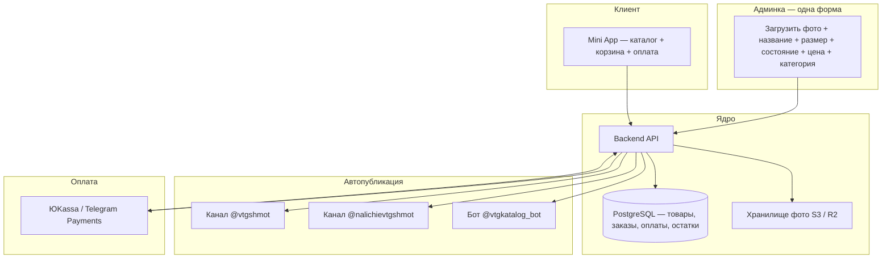

# VTGSHMOT — изучение экосистемы и план автоматизации

> Дата: 28 августа 2026  
> Цель: понять текущий процесс, найти дублирование работы и спроектировать единую систему (каталог → каналы → корзина → оплата → финансы).

---

## 1. Карта экосистемы

| Компонент | Ссылка | Подписчики | Роль |
|-----------|--------|------------|------|
| Основной канал | [@vtgshmot](https://t.me/vtgshmot) | ~22 500 | Витрина, дропы, анонсы, контент |
| Канал «Наличие» | [@nalichievtgshmot](https://t.me/nalichievtgshmot) | ~6 600 | Актуальный список того, что ещё в продаже |
| Mini App / каталог | [@vtgkatalog_bot/shop](https://t.me/vtgkatalog_bot/shop) | — | Каталог, корзина, фильтры |
| Заказы (ручной) | [@vtgceo](https://t.me/vtgceo) | — | Скриншот корзины → менеджер |
| Отзывы | [@otzyvyvtgshmot](https://t.me/otzyvyvtgshmot) | — | Социальное доказательство |
| Офлайн | СПб, ул. Некрасова 52 | — | Шоурум, ивенты, самовывоз |

**Важно:** дублирование может быть не только «канал + приложение», но и **третий канал наличия** — формат постов там почти такой же.

---

## 2. Как выглядит процесс сейчас (реконструкция)

### 2.1 Добавление товара

```
Фото + описание
    ├─► Пост в @vtgshmot (медиагруппа + текст + ссылки)
    ├─► Карточка в Mini App (фото, название, цена, размер, состояние)
    └─► (вероятно) Пост в @nalichievtgshmot
```

### 2.2 Формат поста в канале

Пример (футболка Oakley):

```
Футболка Oakley 00s

> состояние отличное
> размер L
> цена: 6990

Оформить заказ | Полное наличие
```

- Медиагруппа: 3–8 фото (общий вид, детали, бирка, спина).
- Две ссылки внизу — скорее всего deep-link в Mini App (конкретный товар / каталог).
- Анонсы дропов — отдельный тип контента (без цены, только тизер).

### 2.3 Mini App (что видно с UI)

| Экран | Функции |
|-------|---------|
| Каталог | Сетка 2 колонки, фильтр «Весь магазин», фильтр «Размер», поиск |
| Карточка | Галерея, цена, «Добавить в корзину» |
| Корзина | +/- количество, удаление, итого, CTA «Написать @vtgceo» |

**Оформление заказа сейчас полностью ручное:**
> «Для оформления сделайте скриншот корзины и перейдите в диалог с @vtgceo»

Нет встроенной оплаты, нет автоматической резервации товара.

### 2.4 Бизнес-модель (из публичных данных)

- Винтаж, **уникальные позиции** (часто 1 экземпляр).
- Регулярные дропы (в описании канала — ~19:00, в постах — разное время).
- ~5–6 постов в день на основном канале.
- Бренды: Nike, Adidas, Polo RL, Stone Island, Arcteryx, Oakley, YSL и др.
- Доставка + офлайн-точка в СПб.

---

## 3. Проблемы и риски текущей схемы

| Проблема | Почему болит |
|----------|--------------|
| Двойной/тройной ввод | Время, ошибки в цене/размере между каналом и каталогом |
| Скриншот → DM | Медленно, нет трекинга заказов, легко «продать дважды» |
| Нет единого статуса | sold / reserved / available не синхронизированы |
| **Офлайн vs Telegram** | Продали в шоуруме — в TG всё ещё «в наличии» |
| Нет финансовой аналитики | Выручка, маржа, остатки — вручную или в Excel |
| Нет анти-дубль при оплате | Два клиента могут положить одну уникальную вещь в корзину |
| Нет контент-календаря | Дропы и серии постов планируются «в голове» или в заметках |

---

## 3.1 Что нужно от друга — честный список

**Короткий ответ:** токен + права на каналы — это **минимум для автопоста**, но **не «и всё само заработает»**. Нужен ещё переход на новую систему и дисциплина в шоуруме.

### Минимум для Этапа 1 (один ввод → канал + каталог)

| Что | Зачем | Кто делает |
|-----|-------|------------|
| **Токен бота** @vtgkatalog_bot (или новый бот) | Постинг, Mini App, уведомления | Друг даёт / создаём вместе через BotFather |
| **Бот — админ** в @vtgshmot и @nalichievtgshmot с правом публиковать | Автопост и редактирование «ПРОДАНО» | Друг добавляет бота админом |
| **Смена URL Mini App** в BotFather (`/setmenubutton`, `/newapp`) | Каталог читает из нашей БД, а не старой админки | Раз + токен |
| **Экспорт текущего каталога** (если есть) | Не потерять 200+ позиций при миграции | Друг или разработчик старого приложения |
| **Шаблон поста** «как сейчас» | Автопост выглядит как ручной | Один раз согласовать текст и ссылки |
| **Хостинг** (VPS + домен с HTTPS) | Telegram требует HTTPS для Mini App | Мы поднимаем, друг не трогает |

### Для офлайн-точки (главная боль сейчас)

| Что | Зачем |
|-----|-------|
| **1 кнопка «Продано в магазине»** в админке (телефон у кассы) | Снять с витрины TG + каталог + канал наличия за 2 секунды |
| **Доступ сотрудникам шоурума** (логин Telegram или PIN) | Не только @vtgceo помнит, что ушло с полки |
| **QR / артикул на бирке** (опционально, позже) | Продавец сканирует → sold — ещё быстрее |

Без этого офлайн по-прежнему «в голове», даже с идеальным ботом.

### Для оплаты переводом на карту (без ЮKassa)

| Что | Зачем |
|-----|-------|
| **Не нужен** договор ЮKassa на старте | Большинство платят переводом — ок |
| **Нужен** флоу: заказ → «ждём перевод» → админ «оплата получена» → sold | Структура вместо скриншотов |
| Реквизиты / номер карты в шаблоне сообщения клиенту | Автотекст после оформления заказа |

ЮKassa — **Этап 3+**, когда захочет автоматизировать онлайн.

### Для планировщика серии постов

| Что | Зачем |
|-----|-------|
| **Черновики постов** (текст + фото + дата/время) | «Завтра в 17:00 дроп рубашек» — заложить заранее |
| Права бота в канале | Без этого отложенный пост не уйдёт |
| Решение: анонс дропа vs карточка товара | Разные типы постов в планировщике |

**Итого от друга на старте:** ~30 минут (админ бота в каналах, токен, BotFather, созвон по шаблону) + **приучить шоурум жать «продано»**. Всё остальное — наша разработка и хостинг.

---

## 3.2 Офлайн + Telegram — один остаток

Сейчас три «источника правды»: канал, приложение, полка в магазине. Нужен **один**:

```
                    ┌─────────────────┐
                    │  products.status │
                    │  available/sold  │
                    └────────┬─────────┘
         ┌───────────────────┼───────────────────┐
         ▼                   ▼                   ▼
   Mini App            @vtgshmot           Шоурум
   (скрыть карточку)   (ПРОДАНО / edit)    (не висит на вешалке)
         │                   │
         └─────────┬─────────┘
                   ▼
           @nalichievtgshmot
           (убрать из наличия)
```

**Кто и как снимает с продажи:**

| Канал продажи | Действие | Кто |
|---------------|----------|-----|
| Заказ в TG + перевод | Админ: «Оплата получена» | @vtgceo / менеджер |
| Заказ в TG + онлайн (позже) | Авто при webhook | Система |
| Купили в шоуруме | Скан штрихкода / QR **или** «Продано в магазине» | Продавец на месте |
| Резерв «примеряет» | «Зарезервировано до …» | Продавец |

Поле `sold_channel`: `telegram` | `offline` | `mixed` — для финансов и отчётов «сколько в зале vs онлайн».

---

## 3.2.1 Серия штрихкодов в базе (рекомендуется для шоурума)

**Идея:** заранее сгенерировать партию внутренних кодов, напечатать на бирки, при заведении товара **привязать** код к карточке. Продажа в зале = **скан** → sold везде за 1 секунду. Не нужно искать товар в списке на телефоне.

### Почему не «настоящий EAN»

| Вариант | Плюсы | Минусы |
|---------|-------|--------|
| **Внутренний код** `VTG-000847` | Бесплатно, полный контроль | Только свой сканер / админка |
| **Code 128 / QR** с UUID или числом | Печатается на любой термопринтер | — |
| EAN-13 (GS1) | Универсальные сканеры | Платная регистрация, для винтажа избыточно |

Для винтажа с **уникальными позициями** — внутренняя серия оптимальна.

### Модель в БД

```sql
barcodes (
  id,
  code,              -- 'VTG-000847' или '847' — уникальный
  status,            -- pool | assigned | sold | void
  product_id,        -- null пока бирка не привязана
  batch_id,          -- партия печати «2026-03 roll 1»
  assigned_at,
  sold_at
)

-- products.barcode_id → FK (опционально дубль для быстрого join)
```

**Статусы бирки:**

```
pool       → напечатана, ещё не на вещи
assigned   → привязана к товару, в продаже
sold       → продана (offline или online)
void       → испорчена / потеряна / ошибка печати
```

### Жизненный цикл

```
1. Админ: «Сгенерировать 500 кодов» → batch в БД + PDF для печати
2. Печать бирок (термопринтер ~3–8k ₽, лента ~300 ₽/1000)
3. Вешаешь вещь на полку → сканируешь ПУСТУЮ бирку
4. Форма «новый товар» → код уже подставлен → фото, название, цена → publish
5. Продажа в зале → скан той же бирки → sold → TG + каталог + каналы
6. Продажа онлайн → по product_id бирка тоже → sold (без повторного скана)
```

### Печать

- **PDF лист** A4: сетка 40–65 бирок (Code 128 + текст `VTG-000847`) — старт без принтера, обычный принтер + ножницы.
- **Термопринтер** 58/40 mm (Xprinter, HPRT) — нормальный вид на вешалке, ~2 сек на бирку.
- **QR вместо штрихкода** — удобнее сканировать камерой телефона в Admin Mini App (хуже для дешёвых лазерных сканеров).

**Практичный микс:** один **QR с URL** на бирке + короткий код текстом (`VTG-847`) на случай если этикетка стёрлась. См. §3.2.2 — тот же QR для админа и для покупателя.

### Сканирование в шоуруме

| Способ | Стоимость | UX |
|--------|-----------|-----|
| Admin Mini App, камера телефона | 0 | Достаточно для 5–20 продаж/день |
| Bluetooth-сканер (~2k ₽) | Низкая | Как на кассе: «пик» → sold |
| Планшет у кассы | Средняя | Крупный экран, список последних сканов |

Сканер эмулирует клавиатуру — вводит `VTG-000847` + Enter в поле поиска админки.

### Связка «скан при заведении товара»

При добавлении шмотки **два сценария:**

| Сценарий | Когда |
|----------|-------|
| **A. Сначала бирка** | Вещь пришла на полку → скан пустого кода → фото → автопост в TG |
| **B. Сначала TG** | Сфоткал дома → в форме «Привязать бирку» → скан позже в зале |

Оба ведут к одному `product_id ↔ barcode`.

### Защита от косяков

- Повторный скан sold → «Уже продано 12.03 @vtgceo».
- Скан `pool` без карточки → «Бирка не привязана — завести товар?»
- Скан `assigned` + другой product → алерт, не перезаписывать молча.
- Онлайн-резерв: бирка `assigned`, статус товара `reserved` — скан на кассе спрашивает «снять резерв?».

### Что нужно от друга

| Что | Обязательно? |
|-----|--------------|
| Токен + каналы | Да (как раньше) |
| Термопринтер | Нет на старте (PDF) |
| Телефон / сканер в зале | Да, для скана |
| Один раз: «генерируем партию 500–1000» | Да |

**Итого:** серия штрихкодов в базе — **лучший способ** закрыть офлайн/TG рассинхрон. Кнопка «Продано в магазине» остаётся запасным путём, если бирка отклеилась.

---

## 3.2.2 Один QR — админка для staff, витрина для покупателя

**Идея:** на бирке QR кодирует **публичный URL**, не просто число:

```
https://vtgshmot.ru/i/VTG-000847
```

Один код — два сценария:

| Кто сканирует | Что видит |
|---------------|-----------|
| **Продавец** (Admin Mini App / бот, Telegram initData) | «Завести карточку» / «Продано» / «Редактировать» |
| **Покупатель** (обычная камера → браузер) | Красивая страница вещи + кнопка «Купить в Telegram» |

Backend по `code` + **кто ты** (админ или гость) отдаёт разный UI или редирект.

### Публичная страница вещи (mobile-first)

Пример блоков — «вся интересная инфа» для винтажа:

| Блок | Пример |
|------|--------|
| Галерея | 4–8 фото, зум, свайп |
| Название + бренд | «Футболка Oakley 00s» |
| Цена | 6 990 ₽ · **В наличии** / Зарезервировано / Продано |
| Размер | L (на бирке + замеры: грудь 54 см, длина 72 см) |
| Состояние | «Отличное» + фото мелких дефектов |
| Эпоха / детали | 00s, оригинал, редкий принт |
| История (опционально) | «Из японского архива», «1 of 1» |
| CTA | **Открыть в каталоге Telegram** · Написать @vtgceo |
| Адрес шоурума | Некrasova 52 — «Примерить сегодня» |
| Похожие вещи | 3 карточки из того же бренда/размера |

Если **sold** — не 404, а «Эта вещь уже нашла хозяина» + похожие + ссылка на канал.

### Связка с Mini App

Кнопка на странице:

```
t.me/vtgkatalog_bot/shop?startapp=product_847
```

или `startapp=p_000847` — открывает **ту же карточку** в Mini App, можно сразу в корзину. QR в зале → browsing → Telegram checkout без скриншотов.

### Флоу админа (тот же QR)

1. Скан в Admin Mini App → код `VTG-000847`, status `pool`.
2. Форма: фото, название, размер, состояние, цена, замеры, «история».
3. Save → `assigned` + автопост в каналы + **страница `/i/VTG-000847` сразу живая**.
4. Покупатель у вешалки сканирует — уже полная карточка, не пустышка.

### SEO и шеринг (бонус)

- URL можно кидать в Instagram / Stories: «Примерь в шоуруме, код на бирке».
- Open Graph: превью с главным фото + цена при шеринге ссылки.
- Индексация опциональна (`noindex` для sold, `index` для available — на выбор).

### Техника

```
GET /i/:code          → публичная SSR/SPA страница (без авторизации)
GET /api/public/:code → JSON для страницы (кэш CDN)
POST /admin/scan      → initData Telegram, действия assign/sell
```

QR генерируем при создании партии — URL уже зашит, `product_id` подставится позже.

### Что не светим публично

- Закупочная цена (`cost_rub`) — только админ.
- Внутренние заметки («взял у @xxx за 3k»).
- Telegram user id покупателя.

---


Онлайн-касса не обязательна на первом этапе. Флоу:

1. Клиент оформляет заказ в Mini App (без скриншота).
2. Товары → `reserved` на 30–60 мин.
3. Бот / Mini App: «Переведите X ₽ на карту …, в комментарии заказ #123».
4. Менеджер видит заказ в админке, сверяет перевод в банке.
5. Кнопка **«Оплата получена»** → `sold` → синхронизация везде.

Позже тот же заказ можно перевести на ЮKassa — клиент нажимает «Оплатить картой», webhook делает шаг 5 автоматически.

---

## 3.4 Планировщик серии постов

Два типа контента (у них уже есть оба):

| Тип | Пример | Поля |
|-----|--------|------|
| **Анонс / дроп** | «Завтра в 17:00 выгрузим дроп с рубашками…» | фото, текст, `scheduled_at`, канал |
| **Карточка товара** | «Футболка Oakley 00s», цена, размер | привязка к `product_id`, автогенерация текста |

**Серия постов** — очередь в админке:

```
Пн 19:00  — анонс дропа (3 фото)
Вт 17:00  — дроп: товар 1, 2, 3… (авто из очереди product_ids)
Ср 19:00  — товар 4, 5…
Сб 12:00  — ивент шоурум (отдельный шаблон)
```

- Черновик → **запланирован** → **опубликован** / отмена.
- Напоминание админу за 15 мин до публикации (опционально).
- Массовый дроп: загрузил 20 позиций → «опубликовать по 5 каждые 2 часа» — правило серии.

Таблица `scheduled_posts`: `id`, `type`, `channel`, `payload`, `scheduled_at`, `status`, `telegram_message_ids[]`.

---

## 4. Целевая архитектура (единый контур)



### 4.1 Модель данных (минимум для винтажа)

```sql
-- Товар = уникальная вещь (не массовый SKU)
products (
  id, title, description,
  brand, category,
  size, condition_text,
  price_rub, cost_rub,          -- для маржи
  status,                       -- available | reserved | sold | archived
  reserved_until,               -- TTL резерва при checkout
  channel_post_id,            -- id поста в @vtgshmot
  availability_post_id,       -- id поста в @nalichievtgshmot
  mini_app_slug,              -- deep link
  created_at, sold_at
)

product_images (id, product_id, url, sort_order)

orders (
  id, telegram_user_id, status,
  total_rub, payment_id, payment_status,
  delivery_type, address, created_at
)

order_items (order_id, product_id, price_rub)

payments (id, order_id, provider, amount, status, raw_payload)

-- опционально: drops для анонсов без товаров
drops (id, title, scheduled_at, channel_post_id, status)
```

### 4.2 Жизненный цикл товара

```
available → (клиент checkout) → reserved (15–30 мин)
    → paid → sold (+ убрать из каталога, обновить каналы)
    → timeout / cancel → available
```

Для винтажа **quantity = 1** почти всегда; поле `quantity` нужно только если появятся массовые позиции.

### 4.3 Автопостинг в Telegram

Один вызов `POST /admin/products` должен:

1. Сохранить товар в БД и загрузить фото.
2. `sendMediaGroup` в @vtgshmot с шаблоном текста.
3. Аналогичный (или сокращённый) пост в @nalichievtgshmot.
4. Сделать товар видимым в Mini App API.
5. Сохранить `message_id` постов для будущего редактирования/удаления при продаже.

При продаже:
- Статус → `sold`
- Mini App скрывает карточку
- Редактировать пост в канале: «ПРОДАНО» или удалить из канала наличия

**Требования Telegram:**
- Бот должен быть админом каналов с правом постинга.
- Для каналов — `channel_id` (например `-100...`).

### 4.4 Оплата (РФ)

| Вариант | Плюсы | Минусы |
|---------|-------|--------|
| Telegram Payments + ЮKassa | Оплата внутри Telegram, меньше шагов | Настройка через BotFather, комиссии |
| ЮKassa виджет / ссылка в Mini App | Гибче, знакомый флоу | Выход из «нативного» UX |
| СБП по ссылке | Просто | Ручная проверка, не автоматизирует sold |

**Рекомендация:** Telegram Payments + ЮKassa для B2C в России; webhook на backend для подтверждения и перевода товара в `sold`.

### 4.5 Админка

Варианты по сложности:

1. **Telegram Admin Mini App** — форма внутри Telegram (удобно с телефона на дропе).
2. **Web-панель** — таблица товаров, заказы, выручка, экспорт.
3. **Бот-команды** — `/add` с пошаговым диалогом (быстрый MVP).

Для дропов с телефона часто хватает Mini App админки + автопост.

---

## 5. Поэтапный план (без календарных сроков)

### Этап 0 — Аудит (нужен доступ друга)

- [ ] Кто сделал текущий Mini App? (TGShop / Appy / Posman / кастом / @Sanykon_19?)
- [ ] Есть ли админка каталога и экспорт товаров?
- [ ] Токен бота @vtgkatalog_bot и права бота в каналах?
- [ ] Сколько реально дублируется: 2 или 3 места?
- [ ] Текущий процесс заказа у @vtgceo (CRM, таблица?)

### Этап 1 — MVP «один ввод → всё опубликовано»

- PostgreSQL + простой backend (Node/FastAPI).
- Форма: фото, название, размер, состояние, цена.
- Автопост в 1–2 канала + API для каталога.
- Mini App читает только из API (новый фронт или адаптация текущего).
- **Кнопка «Продано в магазине»** — с первого дня, иначе офлайн ломает остатки.
- **Партия внутренних штрихкодов** (pool → assign → scan sold) — см. §3.2.1.
**Результат:** друг перестаёт делать двойную работу; шоурум снимает вещь с TG одним тапом.

### Этап 2 — Заказы + перевод на карту

- Корзина → «Оформить заказ» → заказ в БД + реквизиты + уведомление @vtgceo.
- Резервация 30–60 мин без оплаты.
- Админ: «оплата получена» / «отменить» → sold / available.
- Канал продажи: `telegram` vs `offline` в отчётах.

**Результат:** вместо скриншотов — заказы; перевод на карту остаётся, но учёт централизован.

### Этап 2.5 — Планировщик постов

- Очередь: анонсы дропов + серии карточек товаров по расписанию.
- Шаблоны текста как сейчас в канале.
- Массовый дроп: N товаров → правило «по K штук каждые H часов».

**Результат:** «завтра в 17:00» закладывается один раз, не вспоминать в последний момент.

### Этап 3 — Оплата онлайн (опционально)

- ЮKassa + Telegram Payments.
- Webhook → `paid` → `sold` → синхронизация каналов.

### Этап 4 — Финансы и аналитика

- `cost_rub` на товар → маржа по заказу.
- Дашборд: выручка онлайн vs офлайн, средний чек, остатки.
- Остатки = count where status = available (единый список для TG и зала).

### Этап 5 — Дропы и маркетинг (расширение)

- Авто-напоминание в канал за N часов до дропа.
- (Опционально) интеграция с рилсами / репост-скидками из постов.

---

## 6. Стек (рекомендация)

| Слой | Технология | Почему |
|------|------------|--------|
| Backend | **FastAPI** или **Node + Hono** | Быстро, async, webhook-friendly |
| DB | **PostgreSQL** | Заказы, финансы, надёжность |
| ORM | SQLAlchemy / Prisma | — |
| Mini App | **React + Vite** + `@twa-dev/sdk` | Стандарт для TMA |
| Бот | **grammY** / **aiogram 3** | Постинг, уведомления |
| Фото | S3 / Cloudflare R2 | CDN, не зависеть от Telegram file_id |
| Хостинг | VPS (Timeweb / Selectel / Hetzner) | HTTPS обязателен для TMA |
| Оплата | ЮKassa | РФ, Telegram Payments |

Альтернатива «быстрый старт без кода»: TGShop / BotLaunch — но для **полного контура с финансами и кастомным автопостом в два канала** кастомный backend обычно гибче.

---

## 7. Вопросы к другу (чеклист для созвона)

1. Сколько минут уходит на одну позицию (канал + каталог + наличие)?
2. Кто и как сейчас добавляет товары в приложение?
3. Можно ли выгрузить текущий каталог (Excel / API)?
4. Как часто расхождения цены/размера между каналом и приложением?
5. Нужна ли оплата онлайн или часть клиентов только «написать и перевести на карту»? → **перевод — основной флоу на старте**
6. Кто в шоуруме будет жать «продано» — только он или сотрудники?
7. Доставка: СДЭК, Почта, самовывоз — что автоматизировать?
8. Планируются ли массовые дропы (100 джерси) — отличается от одиночных винтажных позиций?
9. Как сейчас планируются серии постов (дроп в 17:00 + N карточек после)?

---

## 8. Оценка сложности

| Компонент | Объём | Зависимости |
|-----------|-------|-------------|
| Схема БД + API товаров | Средний | Аудит текущих полей |
| Автопост в 2 канала | Средний | Права бота, шаблоны текста |
| Новый Mini App (каталог) | Средний | Дизайн можно копировать текущий |
| Корзина + резервация | Средний | Уникальные SKU |
| Оплата ЮKassa | Средний+ | Юр. лицо / ИП, BotFather |
| Админка + финансы | Средний | cost_rub, отчёты |
| Планировщик постов / серии | Средний | Шаблоны, cron, права бота |
| Синхронизация офлайн sold | Низкий (кнопка) | Дисциплина в шоуруме |

**Главный риск:** неизвестная текущая платформа Mini App — от этого зависит, мигрируем или интегрируем.

**Главный архитектурный принцип:** одна записа в `products` → все каналы и UI — **генераторы представления**, не отдельные источники истины.

---

## 9. Следующий шаг

1. Получить от друга доступ к админке каталога и 30 минут на созвон по чеклисту (§7).
2. Выбрать: **миграция на свой стек** vs **доработка текущей платформы**.
3. Собрать **Этап 1** (один ввод → автопост) как первый deliverable — максимальный ROI для друга.

---

*Документ подготовлен на основе скриншотов Mini App, публичных страниц t.me/s/vtgshmot и t.me/s/nalichievtgshmot, и описаний канала.*
